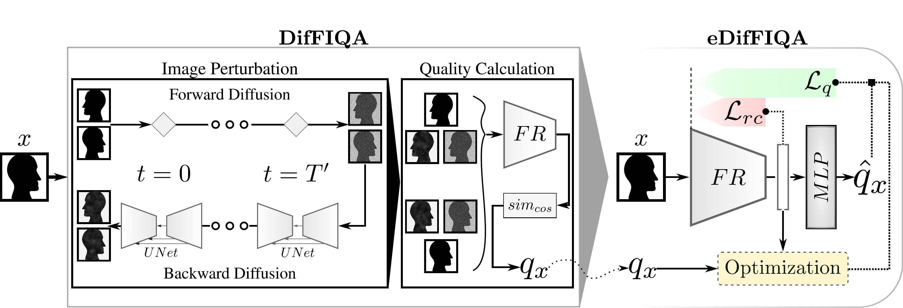
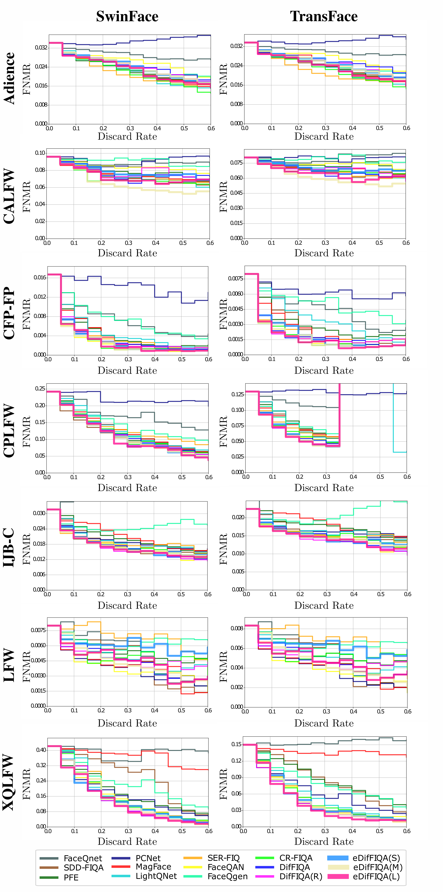

# Official repository of the paper "eDifFIQA: Towards Efficient Face Image Quality Assessment based on Denoising Diffusion Probabilistic Models"

This is the official repository of "eDifFIQA: Towards Efficient Face Image Quality Assessment based on Denoising Diffusion Probabilistic Models" accepted in IEEE TBIOM (Transactions on Biometrics, Behavior, and Identity Science) available [here](https://ieeexplore.ieee.org/document/10468647).

---


:hourglass: __eDifFIQA(L) has been submitted to the [NIST FATE-Quality track](https://pages.nist.gov/frvt/html/frvt_quality.html). Awaiting publication of results.__

:bulb: __eDifFIQA(T) a lightweight (tiny) model has been added to the [OpenCV Model ZOO repository](https://github.com/opencv/opencv_zoo).__

:bulb: __All models have been made available on [HuggingFace](https://huggingface.co/LSIbabnikz).__


## __Table of Contents__

  - [**1.Overview**](#1-overview)
    - [**1.1 Paper Abstract**](#11-paper-abstract)
    - [**1.2 Methodology**](#12-methodology)
    - [**1.3 Results**](#13-results)

  - [**2. Use of repository**](#2-use-of-repository)
    - [**2.1. Environment setup**](#21-environment-setup)
    - [**2.2 Inference**](#22-inference)
    - [**2.3 Training**](#23-training)

  - [**3. Citation**](#3-citation)

___

## __1.Overview__

### __1.1 Paper Abstract__ 

State-of-the-art Face Recognition (FR) models perform well in constrained scenarios, but frequently fail in difficult real-world scenarios, when no quality guarantees can be made for face samples. For this reason, Face Image Quality Assessment (FIQA) techniques are often used by FR systems, to provide quality estimates of captured face samples. The quality estimate provided by FIQA techniques can be used by the FR system to reject samples of low-quality, in turn improving the performance of the system and reducing the number of critical false-match errors. 
However, despite steady improvements, ensuring a good trade-off between the performance and computational complexity of FIQA methods across diverse face samples remains challenging.
In this paper, we present DifFIQA, a powerful unsupervised approach for quality assessment based on the popular denoising diffusion probabilistic models (DDPMs) and the extended (eDifFIQA) approach.
The main idea of the base DifFIQA approach is to utilize the forward and backward processes of DDPMs to perturb facial images and quantify the impact of these perturbations on the corresponding image embeddings for quality prediction.
Because of the iterative nature of DDPMs the base DifFIQA approach is extremely computationally expensive. 
Using eDifFIQA we are able to improve on both the performance and computational complexity of the base DifFIQA approach, by employing label optimized knowledge distillation.
In this process, quality information inferred by DifFIQA is distilled into a quality-regression model. During the distillation process we use an additional source of quality information hidden in the relative position of the embedding to further improve the predictive capabilities of the underlying regression model. By choosing different feature extraction backbone models as the basis for the quality-regression eDifFIQA model, we are able to control the trade-off between the predictive capabilities and computational complexity of the final model. 
We evaluate three eDifFIQA variants of varying sizes in comprehensive experiments on 7 diverse datasets containing static-images and a separate video-based dataset, with 4 target CNN-based FR models and 2 target Transformer-based FR models and against 10 state-of-the-art FIQA techniques, as well as against the initial DifFIQA baseline and a simple regression-based predictor DifFIQA(R), distilled from DifFIQA without any additional optimization.
The results show that the proposed label optimized knowledge distillation improves on the performance and computationally complexity of the base DifFIQA approach, and is able to achieve state-of-the-art performance in several distinct experimental scenarios. Furthermore, we also show that the distilled model can be used directly for face recognition and leads to highly competitive results.

### __1.2 Methodology__



__Overview of DifFIQA and eDifFIQA.__ The base approach of DifFIQA, consists of two main parts: the _Diffusion Process_ and the _Quality-Score Calculation_. The diffusion process uses a custom UNet model, to generate noisy and reconstructed images using the forward and backward diffusion processes, respectively. To capture the effect of face pose on the quality estimation procedure, the process is repeated with a horizontally flipped image. The Quality Score Calculation part estimates the quality of samples by producing and comparing the embeddings of the original sample and the images generated by the diffusion part. To improve on the performance and computational complexity of the base DifFIQA approach, eDifFIQA employs knowledge distillation and label optimization. Here, the quality label $q_x$ of a given training sample $x$ produced by DifFIQA, is first optimized using additional quality information derived from the relative position of the sample within the embedding space of the feature extraction FR model. The quality information is then distilled into the model, consisting of a feature extraction FR backbone and an MLP quality-regression head, by employing a representation consistency $\mathcal{L}_{rc}$ and quality $\mathcal{L}_{q}$ loss, both of which help to improve the predictive capabilities of the final trained quality-regression model.

### __1.3 Results__


__Comparison to the state-of-the-art with (non-interpolated) EDC curves and CNN-based face recognition models.__ The results are presented for $7$ datasets, $4$ FR models and with $10$ recent FIQA competitors.  DifFIQA and eDifFIQA perform close-to or better than all other methods included in the experiments in all configurations, i.e., with a large (L), medium (M) and small (S) regression backbone.




__Comparison to the state-of-the-art with (non-interpolated) EDC curves and Transformer-based face recognition models.__ Results are presented for $7$ datasets, $2$ FR models and with $12$ recent FIQA competitors. DifFIQA and eDifFIQA perform close-to or better than all other methods included in the experiments.


## __2. Use of repository__


### __2.1. Environment setup__

- Create and activate a new conda environment:
  > conda create -n ediffiqa python=3.10

  > conda activate ediffiqa

- Install PyTorch (use appropriate version of CUDA):
  > conda install pytorch torchvision torchaudio pytorch-cuda=11.8 -c pytorch -c nvidia

- Install necessary Python libraries:
  > numpy, scipy, pillow, tqdm, wandb, einops


### __2.2. Inference__

__To perform quality score inference you will need to either train your own regression model as described [below](#2.3-training) or download one of the pretrained models used in the paper, available [here](https://unilj-my.sharepoint.com/:f:/g/personal/zb4290_student_uni-lj_si/EpxkJRo7artCud18dC2NAXcBAegU0uDaSMPwzG9ufcXkLg?e=zhsnho).__

__Once you have a pretrained regression model you can alter the inference script ./configs/inference_config.yaml.__

- Alter the image folder location (_dataset.loc_) to point to the dataset for which you want to extract quality scores.

- Alter the used model (_model_).

- Alter the save location (_base.save\_path_) to the location where you want to save the extracted quality scores.

__Once you have configured the parameters run the inference script.__

> python3 inference.py -c ./configs/inference_config.yaml

---

### __2.3. Training__

__To train the eDifFIQA regression approach first download:__ 
  - The **VGGFace2 quality scores** and the extracted **VGGFace2 embeddings** from [here](https://unilj-my.sharepoint.com/:f:/g/personal/zb4290_student_uni-lj_si/EuphlIAO-2FKrjtc8reVfIoBoaWfNuunad02HVGxpNhqvA?e=yLcmBG).

  - Place them in "./training_data".

- Run the data preparation script using:

  > python3 prepare_data.py

  - The script is configured to prepare data based on CosFace(R100) embeddings. If you wish to train a different model change the "_embeddings_location_" parameter.

- The "prepare_data.py" script will generate two files ("average_embedding_batch" and "training_items") neccesary for the extended training proposed by eDifFIQA. These files can also be obtained [here](https://unilj-my.sharepoint.com/:f:/g/personal/zb4290_student_uni-lj_si/EuphlIAO-2FKrjtc8reVfIoBoaWfNuunad02HVGxpNhqvA?e=yLcmBG).

__Then configure the training configuration file *./configs/train_config.yaml*.__

- Alter the save location (_save\_path_) where you wish to save the trained model.

- Alter the dataset image location (_image\_loc_) to point to the cropped VGGFace2 dataset.

- You are free to alter also the rest of the provided configuration parameters, at your own risk.

__Once you have configured the parameters run the training script.__

> python train.py -c ./configs/train_config.yaml

---


##  __3. Citation__

If you find this work useful, please cite the following papers:

``` 
 @article{babnikTBIOM2024,
  title={{eDifFIQA: Towards Efficient Face Image Quality Assessment based on Denoising Diffusion Probabilistic Models}},
  author={Babnik, {\v{Z}}iga and Peer, Peter and {\v{S}}truc, Vitomir},
  journal={IEEE Transactions on Biometrics, Behavior, and Identity Science (TBIOM)},
  year={2024},
  publisher={IEEE}
}
```


``` 
 @inproceedings{babnikIJCB2023,
  title={{DifFIQA: Face Image Quality Assessment Using Denoising Diffusion Probabilistic Models}},
  author={Babnik, {\v{Z}}iga and Peer, Peter and {\v{S}}truc, Vitomir},
  booktitle={Proceedings of the IEEE International Joint Conference on Biometrics (IJCB)},
  year={2023},
}
``` 